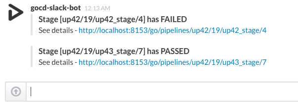

# gocd-slack-build-notifier
Slack based GoCD build notifier



## Setup
Download jar from releases & place it in /plugins/external & restart Go Server.

## Configuration
All configurations are in [HOCON](https://github.com/typesafehub/config) format. Create a file `go_notify.conf` in the server user's (typically /var/go/) home directory. Minimalistic configuration would be something like
```hocon
gocd.slack {
  login = "someuser"
  password = "somepassword"
  server-host = "http://localhost:8153/"
  api-server-host = "http://localhost:8153/"
  webhookUrl = "https://hooks.slack.com/services/...."

  # optional fields
  channel = "#build"
  slackDisplayName = "gocd-slack-bot"
  slackUserIconURL = "http://example.com/slack-bot.png"
  displayMaterialChanges = true
}
```
- `login` - Login for a Go user who is authorized to access the REST API.
- `password` - Password for the user specified above. You might want to create a less privileged user for this plugin.
- `server-host` - FQDN of the Go Server. All links on the slack channel will be relative to this host.
- `api-server-host` - This is an optional attribute. Set this field to localhost so server will use this endpoint to get `PipelineHistory` and `PipelineInstance`  
- `webhookUrl` - Slack Webhook URL
- `channel` - Override the default channel where we should send the notifications in slack. You can also give a value starting with `@` to send it to any specific user.
- `displayMaterialChanges` - Display material changes in the notification (git revisions for example). Defaults to true, set to false if you want to hide.

## Pipeline Rules
By default the plugin pushes a note about all failed stages across all pipelines to Slack. You have fine grain control over this operation.
```hocon
gocd.slack {
  server-host = "http://localhost:8153/"
  webhookUrl = "https://hooks.slack.com/services/...."

  pipelines = [{
    name = "gocd-slack-build"
    stage = "build"
    state = "failed|passed"
    channel = "#oss-build-group"
  },
  {
    name = ".*"
    stage = ".*"
    state = "failed"
  }]
}
```
`gocd.slack.pipelines` contains all the rules for the go-server. It is a list of rules (see below for what the parameters mean) for various pipelines. The plugin will pick the first matching pipeline rule from the pipelines collection above, so your most specific rule should be first, with the most generic rule at the bottom.
- `name` - Regex to match the pipeline name
- `stage` - Regex to match the stage name
- `state` - State of the pipeline at which we should send a notification. You can provide multiple values separated by pipe (`|`) symbol. Valid values are passed, failed, cancelled, building, fixed, broken or all.
- `channel` - (Optional) channel where we should send the slack notification. This setting for a rule overrides the global setting

## License

http://www.apache.org/licenses/LICENSE-2.0
